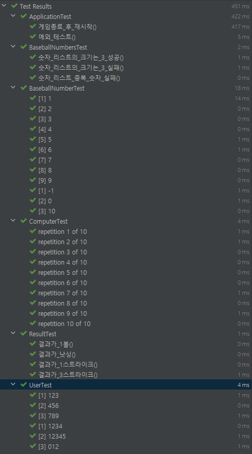
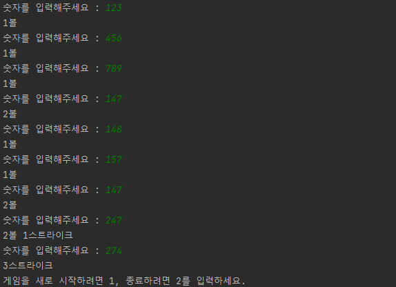

# 숫자 야구 게임

## 기능 요구 사항

- [x] 게임 시작 컴퓨터 숫자 초기화
    - [x] 3자리 랜덤 숫자 생성
        - [x] 숫자가 1 ~ 9로 입력 되었는지 확인
        - [x] 서로 다른 숫자가 입력 되었는지 확인
- [x] 게임 진행 중
    - [x] Player 숫자 입력
        - [x] 같은 수가 다른 자리에 있을 경우 볼
        - [x] 같은 수가 같은 자리에 있을 경우 스트라이크
        - [x] 같은 수가 전혀 없으면 낫싱
        - [x] 3개의 숫자를 모두 맞히면 게임 종료
        - [x] 잘못된 값을 입력할 경우 IlleagalArgumentException 발생
- [x] 게임 종료
    - [x] 게임을 다시 시작
    - [x] 게임을 완전 종료

## Project 구조
- constants: 공통으로 사용하는 상수 package
- game: 게임이 동작하는 비즈니스 로직이 담긴 package
- io: 사용자의 입력과 화면에 출력을 담당하는 package
- model: 모델 package

## 테스트 결과

## 프로그램 실행 결과
